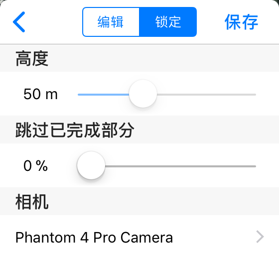

# 基本设置

任务设置面板：

#### 飞行高度

以起飞点为 0 的相对高度，可以设置为 10 米到 500 米之间。安全起见，使用者应当确保飞行高度高过周边所有障碍物。

注意：最大飞行高度也受到 DJI Go 里 “最大飞行高度” 的限制，因此在设置高度前，应当前往 DJI Go 里查看并修改飞机的高度限制。

#### 相机

不同型号的相机具有不同的视角范围，为保证拍摄质量和拍摄效率，使用者应当选择相应的相机型号。

注意：某些相机可以使用不同的镜头，例如 Zenmuse X5S。选择列表里只列出了默认/常见的镜头焦距。如果使用的是不同焦距的镜头，请添加自定义相机并填入相关的参数。

#### 跳过已完成部分

这个选项可以用于更改航线的起点。

在执行一些较大型任务时，常常出现一块电池飞不完，或者在中途因为异常原因中断的情况。在这种情况下，使用者可以通过调整 “跳过已完成部分” 来避免重复拍摄已经完成的部分航线。

如何使用：注意观察航线上白色箭头的位置，然后调整这个选项。可以发现，进度条滑动时，表示航线起点的白色箭头会沿着航线前行方向跳动，略过的部分也会变得黯淡虚化。在下一次执行任务时，飞机就会前往调整后的起点，不再执行略过部分。

在飞机执行任务期间，软件会随着任务的进行自动调整这个数值，同时地图上白色箭头也会随之跳动，这就表示软件已经将任务进度保存下来，以便下次继续执行。
