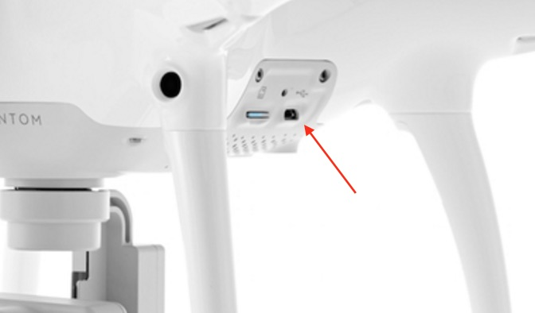
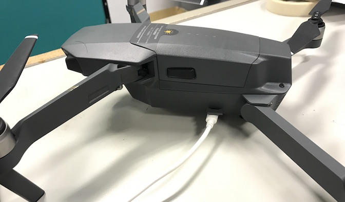
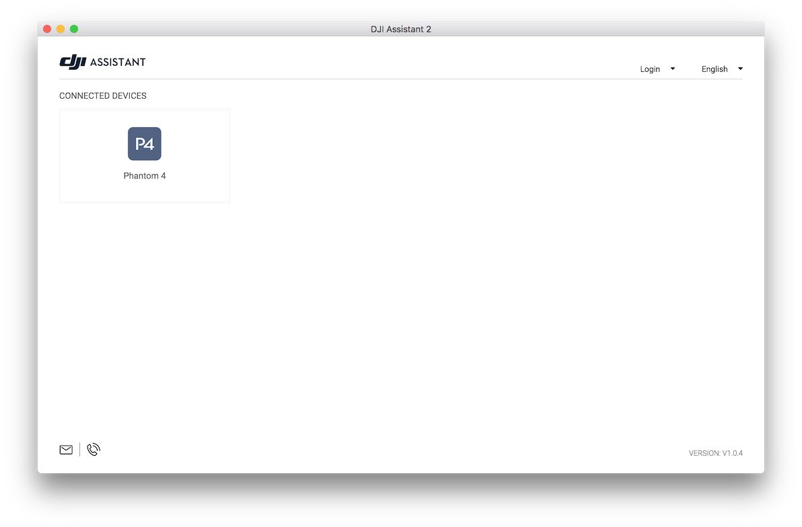
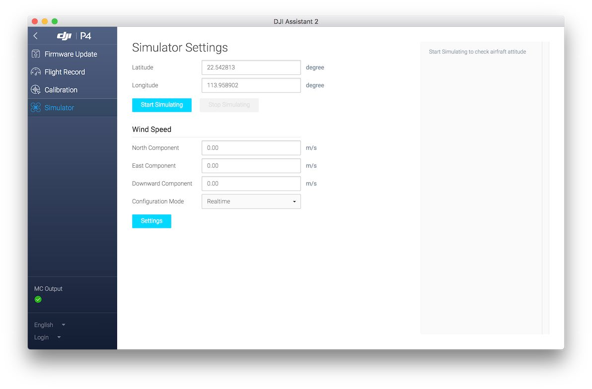
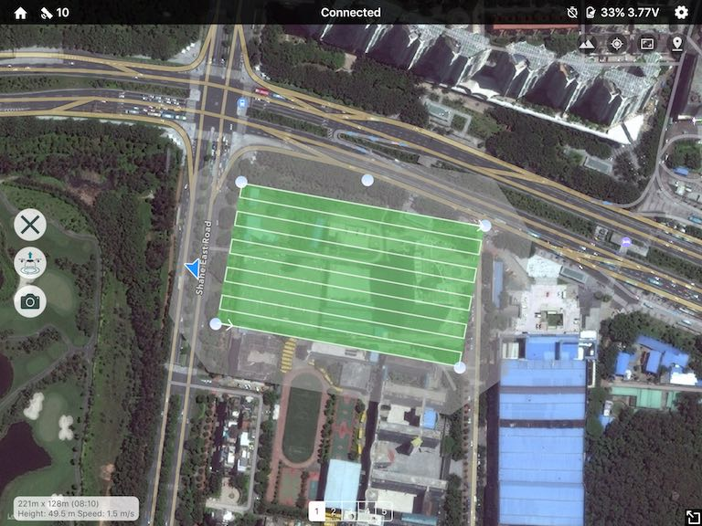

# 在模拟器中学习使用 Altizure \(Mavic, P4, Inspire 2, M600 等\)

#### 支持机型

* Spark
* Mavic Pro
* Phantom 4 \(4 / 4 Advanced / 4 Pro\)
* Inspire 2
* M600, M200, M210 等
* A3, N3 等

#### 支持的操作系统

* Windows
* macOS

#### 1. 下载安装 DJI Assistant 2

前往 DJI 官方产品下载页, 找到软件栏, 下载并安装 DJI Assistant 2 调参软件。

* [Phantom 4 下载页](http://www.dji.com/phantom-4/info#downloads)
* [Phantom 4 Pro 下载页](http://www.dji.com/phantom-4-pro/info#downloads)
* [Inspire 2 下载页](http://www.dji.com/inspire-2/info#downloads)
* [M600 下载页](http://www.dji.com/matrice600/info#downloads)
* [Mavic Pro 下载页](http://www.dji.com/mavic/info#downloads)
* [Inspire 2 下载页](http://www.dji.com/inspire-2/info#downloads)

#### 2. 连接电脑与无人机

打开 DJI Assistant 2，开启无人机的电源，最好不要安装桨叶。用 USB 线连接无人机和电脑。

以下是 Phantom 4 连接后的截图

#### 3. 启动模拟器

点击左侧的“模拟器”, 输入你所在位置附近的经纬度, 点击“开始仿真”。

#### 4. 试用 Altizure

连接手机和遥控，打开 Altizure。在 app 里找到无人机的位置（启动模拟器前输入的经纬度），在附近规划并开始一个新的航点任务。

#### 其他技巧

* 这里有 [DJI 官方教程](https://developer.dji.com/mobile-sdk/documentation/application-development-workflow/workflow-testing.html#aircraft-simulator)介绍如何使用模拟器。
* 模拟器模式下也同样会拍摄照片，请在模拟结束后删除这些照片来释放 SD 卡的储存空间。
* 用鼠标可以拖动模拟器界面变更视角，用鼠标滚轮可以拉近或拉远。
* 右键点击模拟器界面, 点击 **setup**, 选中 **show trace**, 可以显示已飞过的航线。

