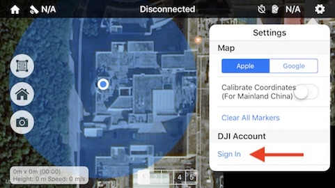
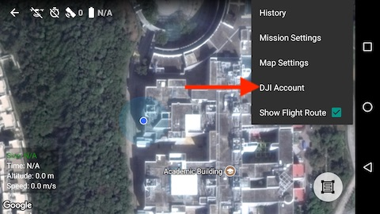

# 初次打开 Altizure

#### 自动联网激活

安装完 Altizure app 第一次打开时，请确保网络通常。因为 app 在连接飞机前必须连接到大疆的服务器进行一次激活，否则无法控制飞机。如果激活失败，app 界面会弹出一个提示窗口，表明激活失败。如果没有弹出，则说明激活成功。

如果使用 Phantom 3 Standard 或 Phantom 3 4K 版，请在初次打开时不要连接飞机的 Wi-Fi。因为飞机的 Wi-Fi 没有连接互联网，会导致激活失败。

完成一次激活后便不再需要联网，可以离线使用。

#### 登录大疆账号

受中国大陆地区法规和大疆的要求，在中国大陆使用第三方 app 控制飞机飞行时，也必须登录大疆账号解锁无人机。否则，飞机的功能将被固件严重限制，只能在小范围内飞行，图传功能会被禁用。

登录入口:
* iOS 版   
* Android 版   